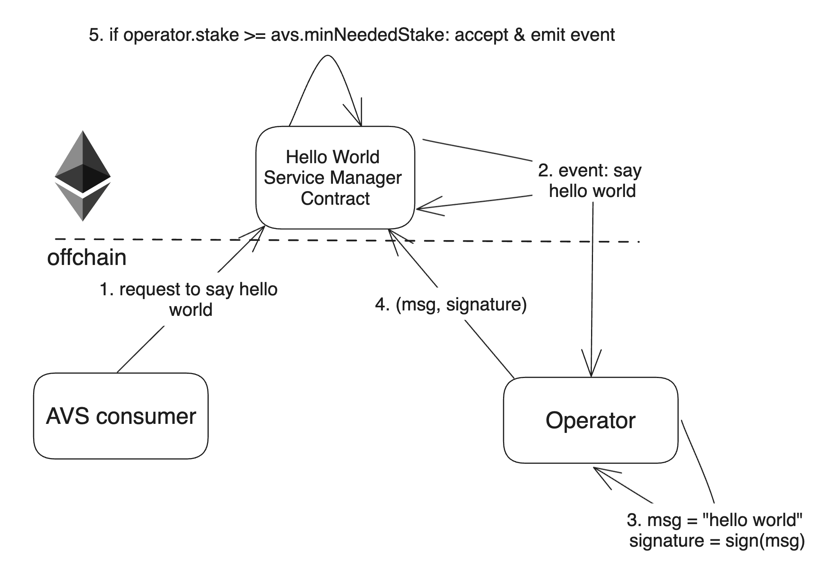

# EigenPow

Welcome to EigenPow.

This project showcases the simplest functionality you can expect from an AVS.

It will give you a concrete understanding of the basic components.



There are 5 steps to this AVS:
- AVS consumer requests a "Hello World" message to be generated and signed.
- AVS takes on the request by emitting an event for operators to pick up the request.
- Any operator who is staked to serve this AVS takes this request, generates this message, and signs it.
- The operator submits this message with their signature back to the AVS.
- *If the operator is in fact registered to the AVS and has the minimum needed stake, the submission is accepted.*

That's it. This simple flow highlights some of the core mechanics of how AVSs work.

Where additional sophistication with AVSs come into the picture:
- The nature of the request is more sophisticated than generating a constant string.
- The operators might need to coordinate with each other.
- The type of signature is different based on the constraints of the service.
- The type and amount of security used to secure the AVS.
- And so on...

## Quick Start

### Dependencies

1. [npm](https://docs.npmjs.com/downloading-and-installing-node-js-and-npm)
2. [Foundry](https://getfoundry.sh/)
3. [Docker](https://www.docker.com/get-started/)
   * Make sure Docker is running

Following NodeJS packages:
1. tcs
2. ethers

### Steps

#### Typescript

1. Run `yarn install`
2. Run `cp .env.local .env`
3. Run `make start-chain-with-contracts-deployed`
    * This will build the contracts, start an Anvil chain, deploy the contracts to it, and leave the chain running in the current terminal.
4. Open a new terminal tab and run `make start-operator`
    * This will compile the AVS software and start monitoring new tasks.
5. Open a new terminal tab and run `make spam-tasks` (Optional)
    * This will spam the AVS with random names every 15 seconds.

#### Rust lang

##### Anvil

1. Run `make start-chain-with-contracts-deployed`
    * This will build the contracts, start an Anvil chain, deploy the contracts to it, and leave the chain running in the current terminal.

2. Run `make start-rust-operator`.

3. Run `make spam-rust-tasks`.

Tests are supported in Anvil only. Make sure to run the 1st command before running the tests:

```
cargo test --workspace
```

##### Holesky Testnet

| Contract Name               | Holesky Address                                   |
| -------------               | -------------                                     |
| Hello World Service Manager | [0x3361953F4a9628672dCBcDb29e91735fb1985390](https://holesky.etherscan.io/address/0x3361953F4a9628672dCBcDb29e91735fb1985390)    |
| Delegation Manager          | [0xA44151489861Fe9e3055d95adC98FbD462B948e7](https://holesky.etherscan.io/address/0xA44151489861Fe9e3055d95adC98FbD462B948e7)                                           |
| Avs Directory               | [0x055733000064333CaDDbC92763c58BF0192fFeBf](https://holesky.etherscan.io/address/0x055733000064333CaDDbC92763c58BF0192fFeBf)      |

You don't need to run any script for the Holesky testnet.

1. Use the HOLESKY_ namespace env parameters in the code, instead of normal parameters.

2. Run `make start-rust-operator`.

3. Run `make spam-rust-tasks`.

## Extensions

- Operator needs a minimum stake amount to make submissions.
- Add another strategy to the AVS.
- Operator must respond within a certain number of blocks.

## Deployment on Holesky

To deploy the EigenPow AVS contracts to the Holesky network, follow these steps:

1. Ensure you have the necessary RPC URL and private key for the Holesky network.
2. Run the deployment script using Foundry:
    ```bash
    forge script script/HoleskyDeployer.s.sol:HoleskyDeployer --rpc-url $RPC_URL --private-key $PRIVATE_KEY --broadcast -vvvv
    ```
    Replace `$RPC_URL` with your Holesky RPC URL and `$PRIVATE_KEY` with your private key.

## Adding a New Strategy

To add a new strategy to the EigenPow AVS, follow the guide provided in [`AddNewStrategy.md`](https://github.com/Layr-Labs/hello-world-avs/blob/master/AddNewStrategy.md). This guide walks you through the necessary steps to add and whitelist a new strategy for the AVS.